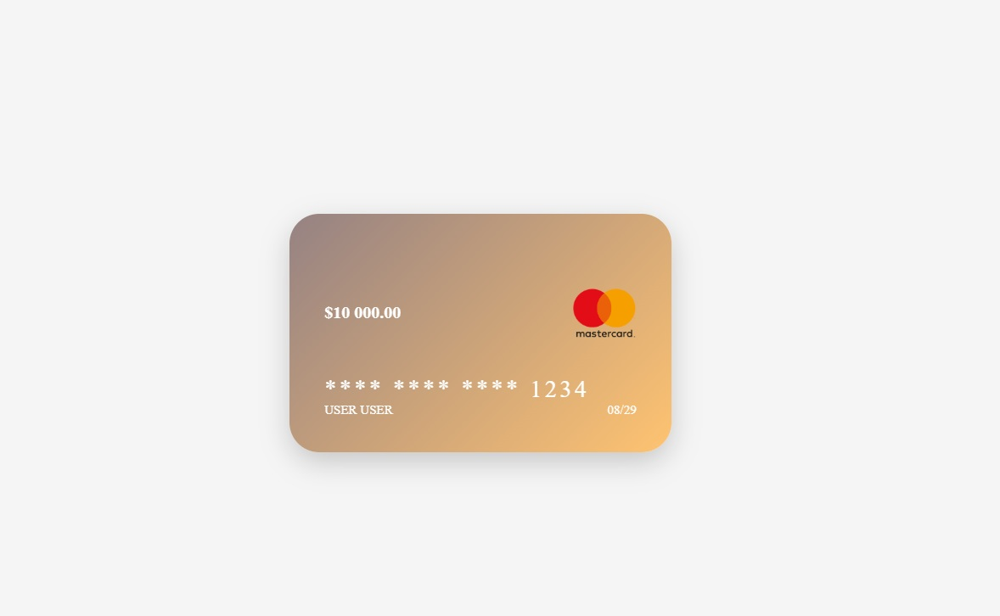

## 💳 Bank Card Flip  
A stylish interactive bank card component built with React.  
It features a smooth 3D flip animation between the front and back sides, gradient backgrounds, and a realistic card shine effect.  

## ✨ Features  
- Interactive 3D flip on click or keyboard (Enter/Space)  
- Front and back sides with realistic layout  
- Smooth shine animation across the card  
- Customizable design (black edition, gradient edition, etc.)  
- Fully responsive (works on desktop and mobile)  
- Accessible: keyboard navigation and aria-labels  

## 🛠 Tech Stack  
- React + Vite  
- CSS3 (flexbox, 3D transforms, animations)  
- GitHub Pages for deployment  

## 📸 Preview  
 

## 🚀 Usage  
Clone the repo and run locally:  

```bash
git clone https://github.com/kozlovoleksii/bank-card.git
npm install
npm run dev
